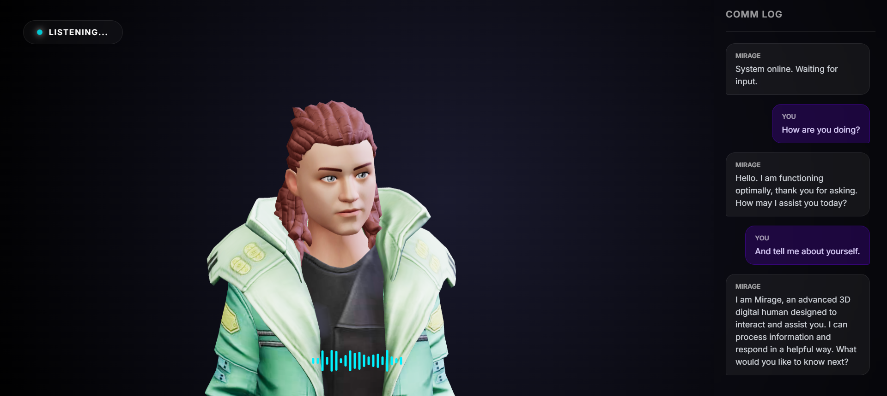

# MIRAGE // Digital Human Interface

A high-fidelity, low-latency conversational 3D avatar designed for real-time human-AI interaction. Mirage integrates state-of-the-art voice processing lines with generative logic to create a responsive digital presence.



## Architecture

Mirage eliminates the "turn-taking latency" common in voice bots through a parallelized audio-visual pipeline:

1.  **Voice Activity Detection (VAD)**: Client-side `Silero VAD` (running on `ONNX Runtime Web`) monitors microphone input in 16kHz frames. It distinguishes human speech from background noise with <20ms latency.
2.  **Speech-to-Text**: Validated audio buffers are sent to **Deepgram Nova-2** for near-instant transcription.
3.  **Generative Core**: The proprietary backend (`FastAPI` + `LangChain`) manages conversation state and routes prompts to **Google Gemini Flash lite latest**.
4.  **Synthesis**: Responses are streamed to **ElevenLabs Turbo v2.5** for high-stability neural speech generation.
5.  **Interruption Engine**: A bespoke flow-control system allows the user to barge in mid-sentence. The system immediately halts audio streams, resets the animation state machine, and shifts attention to the new input.

## Tech Stack

- **Frontend**: Vanilla JavaScript (ES Modules), Three.js, TalkingHead (Avatar Rendering).
- **Backend**: Python 3.12, FastAPI, Uvicorn (WebSocket Server).
- **Inference**:
  - **LLM**: Google Gemini Flash lite latest.
  - **STT**: Deepgram Nova-2 via REST.
  - **TTS**: ElevenLabs Turbo v2.5.
  - **VAD**: Silero VAD (ONNX).

## Local Deployment

### Prerequisites

- Python 3.10+
- FastAPI
- API Keys:
  - `GOOGLE_API_KEY` (Gemini)
  - `ELEVEN_LABS_KEY`
  - `DEEPGRAM_KEY`

### 1. Backend Setup

Clone the repository and install the Python dependencies.

```bash
git clone https://github.com/AmaanP314/mirage.git
cd mirage
pip install -r requirements.txt
```

Start the FastAPI WebSocket server.

```bash
python server.py
# Server runs on ws://localhost:8000
```

### 2. Frontend Initialization

The frontend relies on local WASM/ONNX assets to avoid CDN latency and CORS issues.

**Download Dependencies:**
Run the included utility script to vendor the required logic libraries.

```bash
python download_dependencies.py
```

**Serve the Client:**
You can use any static file server.

```bash
# Using Python
python -m http.server 5500
# or using Live Server in VS Code
```

### 3. Runtime Configuration

Access `http://127.0.0.1:5500` in your browser.

1.  Click **INITIALIZE MIRAGE**.
2.  Enter your API keys in the configuration modal.
3.  System will perform a handshake and enter `IDLE` state.
4.  Speak to interact.

## Performance Optimization

- **WASM Multithreading**: ONNX Runtime is configured to use SIMD instruction sets where available.
- **Asset Vendoring**: All critical WASM binaries are served locally to prevent cold-start latency.
- **Context Windowing**: The backend maintains full history but selectively feeds the last 3-6 turns to the LLM to minimize token latency.

---

_Built by Team Dialexus._
